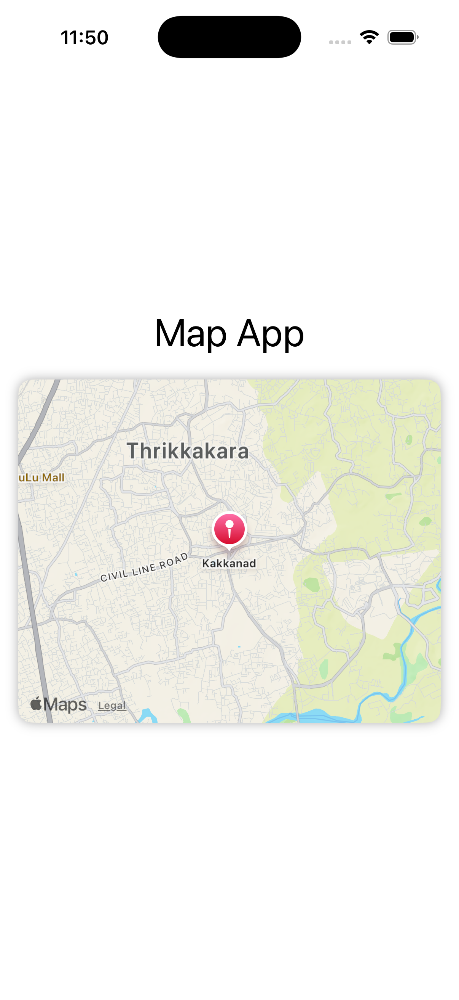
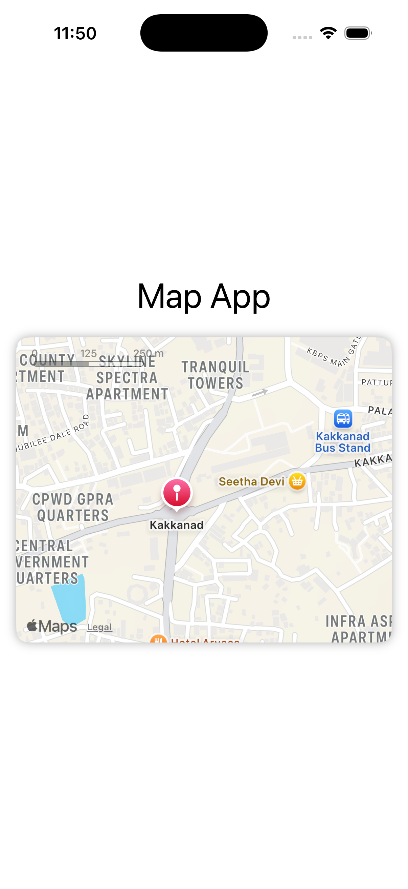

# 🗺️ MapApp (SwiftUI + MapKit)

A simple iOS application built using **SwiftUI** and **MapKit** to display a map view with a marker.  
This app demonstrates how to integrate Apple's **MapKit** with SwiftUI, set custom coordinates, and style map views with camera positions.

---

## 🚀 Features

- 🗺️ **Interactive Map View** — Displays a map centered on a given coordinate.  
- 📍 **Marker Annotation** — Shows a marker at a specified location (Kakkanad in this example).  
- 🎨 **UI Enhancements** — Rounded corners, drop shadow, and responsive layout with SwiftUI.  
- ⚙️ **Custom Camera Position** — Controlled using `MapCameraPosition` and `MKCoordinateRegion`.  

---

## 🧩 Tech Stack

- **Language:** Swift  
- **Frameworks:** SwiftUI, MapKit  
- **Platform:** iOS  
- **IDE:** Xcode 15+  
- **Architecture:** Declarative SwiftUI structure  

---

## 📸 Screenshots

| Map View | Marker View |
|-----------|--------------|
|  |  |


---

## 🏗️ Project Structure

```
MapApp/
│
├── MapApp.swift             # Entry point of the app
├── ContentView.swift        # Main SwiftUI view with map and marker
├── Assets.xcassets          # App assets
└── Preview Content/         # Preview assets for SwiftUI
```

---

## ⚙️ How to Run

1. Clone the repository  
   ```bash
   git clone https://github.com/musthafalabeebka/MapApp.git
   cd MapApp
   ```

2. Open the project in **Xcode**  
   ```bash
   open MapApp.xcodeproj
   ```

3. Build and run the app on an **iPhone simulator** or a **real device**.

---

## 🔍 Code Overview

### Setting Initial Map Region
```swift
@State private var position: MapCameraPosition = .region(
    MKCoordinateRegion(
        center: CLLocationCoordinate2D(latitude: 10.0159, longitude: 76.3419),
        span: MKCoordinateSpan(latitudeDelta: 0.05, longitudeDelta: 0.05)
    )
)
```

### Displaying a Map with Marker
```swift
Map(position: $position) {
    Marker("Kakkanad", coordinate: CLLocationCoordinate2D(latitude: 10.0159, longitude: 76.3419))
}
.frame(height: 300)
.cornerRadius(12)
.shadow(radius: 5)
```

---

## 🌐 Customization Ideas

- Add multiple markers for different locations  
- Implement user location tracking  
- Enable map interaction controls (zoom, rotate, etc.)  
- Integrate directions or route drawing  
- Customize annotation styles  

---

## 🧑‍💻 Author

**Musthafa Labeeb K A**  
📍 Student, MVoc Software Application Development, CUSAT    
🔗 [GitHub Profile](https://github.com/musthafalabeebka)

---

